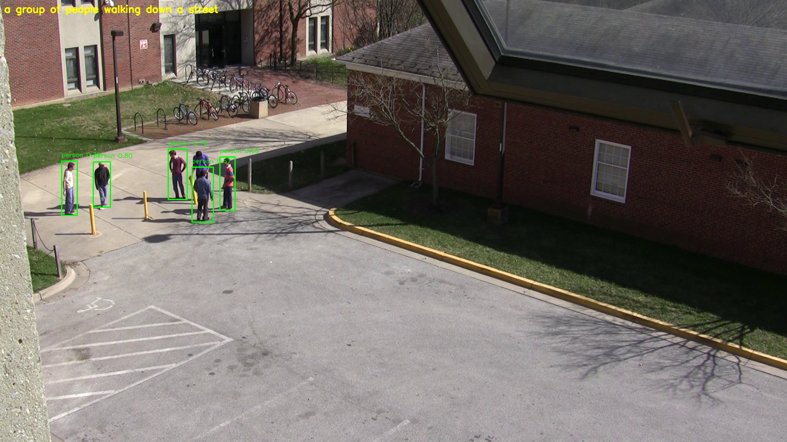

# About our project



The rollout of surveillance cameras in cities, transport terminals, and public places over the last decade has led to huge volumes of video data. Such surveillance systems are vital to public safety and security when they are used to observe suspicious activities or intruders, speeding vehicle and possibly alerts for emergency responses. The volume of footage generated daily does not allow for "eyes-on" monitoring to be practical (or responsive) and may result in missed events and late response times.

With such difficulties, approaches for the analysis of intelligent videos have been receiving more and more attention. Real-time object detection models like YOLOv8 have shown impressive results in being able to accurately and quickly detect key objects, especially people and vehicles, which are at the core of many surveillances use cases. However, classical object detection only has bounding boxes with class and does not have the descriptive context which is very important for incident analysis, reporting and automatic alerts generation.

We propose a comprehensive, end-to-end intelligent surveillance framework that integrates YOLOv8 for detecting people and vehicles, alongside the BLIP model to produce concise and human-readable scene descriptions. For each frame or detected event, the system automatically generates structured logs which record both the detection results and the corresponding natural language captions. These logs can easily be used for further analysis, incident searching, and get alerts in real time, helping to automate things, so to free more time from analysts to do analysis on the incoming security events.

We validate the effectiveness of our approach on datasets including the AI City Challenge, with detection accuracy in term of mean Average Precision (MAP) and the quality of generated captions in terms of BLEU and ROUGE metrics. The integration of advanced object detection and image captioning techniques enhances the value of surveillance data, making automatic monitoring more intuitive and insightful for practical applications.

````markdown

# Smart Surveillance System for Scene Captioning

**An end-to-end pipeline that uses YOLOv8 & BLIP to perform real-time object detection and auto-generate scene captions on surveillance videos.**

This project detects objects in security footage, produces descriptive captions for each event, and outputs JSON logs plus annotated image frames. It is suitable for smart security, anomaly detection, and automated logging.

---

## Repository Structure

```text
Smart-Surveillance-System/
├── README.md
├── LICENSE
├── requirements.txt
├── yolo_blip_pipeline/             # Core code
│   ├── detection.py                # YOLOv8 inference script
│   ├── captioning.py               # BLIP caption generation script
│   ├── utils.py                    # Utility functions (drawing boxes, saving logs, etc.)
│   ├── main.py                     # Entry point that chains detection + captioning on a full video
│   └── config.yaml                 # (Optional) Configuration file (paths, thresholds, etc.)
├── notebooks/
│   ├── demo_colab.ipynb            # Colab notebook for online demonstration
│   └── Demo.ipynb                  # (Optional) Local Jupyter notebook demo
├── docs/
│   ├── draft_paper.pdf             # Springer paper draft (if any)
│   └── slides.pdf                  # Presentation slides (if any)
└── .gitignore
````

* **`requirements.txt`**
  List of required Python libraries, for example:

  ```text
  torch>=1.12
  torchvision>=0.13
  ultralytics
  transformers
  pillow
  opencv-python
  tqdm
  ```
* **`yolo_blip_pipeline/`**
  Contains the scripts that drive the core pipeline:

  * `detection.py`: Runs YOLOv8 object detection on each frame.
  * `captioning.py`: Runs BLIP to generate scene captions.
  * `main.py`: Orchestrates detection and captioning on an entire video, writes annotated frames and JSON logs.
  * `utils.py`: Helper functions (drawing bounding boxes, saving JSON, etc.).
  * `config.yaml` (optional): Consolidates file paths, thresholds, and other parameters.
* **`notebooks/demo_colab.ipynb`**
  A Google Colab notebook showing how to run the entire detection + captioning pipeline online.
* **`docs/`**
  Stores ancillary assets like the draft paper and slides.

---

## 1. Environment & Dependencies

Recommended: Python 3.8+ in a virtual environment (venv, conda, etc.).
Install all required packages with:

```bash
pip install -r requirements.txt
```

> **Note:** If you only intend to run in Google Colab, you do not need to install locally. The Colab notebook will install dependencies automatically.

---

## 2. Model Weights & Sample Video (hosted on Google Drive)

> **Important:** The following files are stored in Google Drive. You must mount Drive in Colab or download them to your local machine before running.

1. **YOLOv8 Weights (`yolov8s.pt`)**

   * Drive path: `MyDrive/Share_project/Smart_Surveillance_System/models/yolov8s.pt`
   * Colab-mounted path:

     ```
     /content/drive/MyDrive/Share_project/Smart_Surveillance_System/models/yolov8s.pt
     ```

2. **BLIP Model Directory (`BLIP_MODEL/`)**

   * Drive path: `MyDrive/Share_project/Smart_Surveillance_System/models/BLIP_MODEL/`
     This folder should contain BLIP’s `config.json`, `pytorch_model.bin`, and related files.
   * Colab-mounted path:

     ```
     /content/drive/MyDrive/Share_project/Smart_Surveillance_System/models/BLIP_MODEL/
     ```

3. **Demo Video (`VIRAT_S_000101.mp4`)**

   * Drive path: `MyDrive/Share_project/Smart_Surveillance_System/video/VIRAT_S_000101.mp4`
   * Colab-mounted path:

     ```
     /content/drive/MyDrive/Share_project/Smart_Surveillance_System/video/VIRAT_S_000101.mp4
     ```

---

## 3. Running Locally

To run on your local machine (assuming you have an NVIDIA GPU with CUDA):

1. **Clone the repository:**

   ```bash
   git clone https://github.com/yourusername/Smart-Surveillance-System.git
   cd Smart-Surveillance-System
   ```

2. **Create & activate a virtual environment (optional but recommended):**

   ```bash
   python3 -m venv venv
   source venv/bin/activate
   ```

3. **Install dependencies:**

   ```bash
   pip install -r requirements.txt
   ```

4. **Download model weights and sample video to local directories:**

   * Place `yolov8s.pt` into `./models/yolov8s.pt`.

   * Place the entire `BLIP_MODEL/` folder into `./models/BLIP_MODEL/`.

   * Place `VIRAT_S_000101.mp4` into `./video/VIRAT_S_000101.mp4`.

   > If you prefer, log into Google Drive and download these files manually, then move them to the above paths.

5. **Run the main pipeline:**

   ```bash
   python yolo_blip_pipeline/main.py \
       --yolo_weights "./models/yolov8s.pt" \
       --blip_dir    "./models/BLIP_MODEL/" \
       --video_path  "./video/VIRAT_S_000101.mp4" \
       --output_dir  "./output"
   ```

6. **Inspect the output:**

   * `./output/frame_XXXX_captioned.jpg`: Sample frames annotated with bounding boxes and captions.
   * `./output/logs.json`: JSON-formatted log of detections and captions for the entire video.

---

## 4. Google Colab Online Demo

If you do not have a local GPU, you can run everything on Google Colab:

https://drive.google.com/drive/folders/1YhH-KXNFYWVBhb-7KrsYyb7tHO8kIeEO?usp=drive_link

The above is a shared project I created on Colab, including test videos, test code, original models, and saved effects videos after testing.

1. Click the “Open in Colab” button below to open `demo_colab.ipynb` in Colab:

   [](https://colab.research.google.com/github/yourusername/Smart-Surveillance-System/blob/main/notebooks/demo_colab.ipynb)

2. In the Colab notebook, execute cells in order:

   1. **Mount Google Drive**
   2. **Install dependencies**
   3. *(Optional)* `git clone` the repo (if you did not upload your code to Drive)
   4. **Define paths** (all pointing to `/content/drive/MyDrive/...`)
   5. **Run `main.py`** to start detection + captioning
   6. **Visualize sample frames** (click to display annotated frames inline)

3. When finished, you can view ` /content/output/` in the Colab file browser. Right-click to download any images or the JSON log.

---

## 5. Frequently Asked Questions (FAQ)

**Q: Why does Colab require Drive mounting?**
A: Because the YOLO weights, BLIP model, and demo video are stored in your Google Drive. You must call `drive.mount('/content/drive')` so that Colab can access `/content/drive/MyDrive/...`. Otherwise, the code cannot locate those files.

---

**Q: How do I avoid downloading large files locally?**
A: Add `models/` and `video/` to your `.gitignore` so they are not pushed to GitHub. Keep only your code, notebooks, and README in the repo. Store all large weights/videos in Google Drive and instruct users to mount/download them as needed.

---

**Q: What if I want to host the models on Hugging Face Hub instead?**
A:

1. Upload `yolov8s.pt` and the entire `BLIP_MODEL/` directory to a Hugging Face Model repository.
2. In your code (e.g., `main.py` or `demo_colab.ipynb`), replace Drive-mount downloads with:

   ```python
   from huggingface_hub import hf_hub_download
   yolo_path = hf_hub_download(repo_id="yourusername/your-model-repo", filename="yolov8s.pt")
   blip_dir  = "/root/.cache/huggingface/hub/models--yourusername--your-blip-repo"
   ```
3. The notebook can then call `hf_hub_download` to retrieve weights directly. Refer to Hugging Face docs for details.

---

**Q: How do I tweak GPU/CPU usage, image size, or confidence thresholds?**
A:

* In `yolo_blip_pipeline/config.yaml` (if present) or via command-line flags to `main.py`, you can pass options like `--imgsz`, `--conf_thresh`, `--device 0` (GPU index) or `--device cpu`.
* You can also modify inside Python code, for example:

  ```python
  model = YOLO(yolo_weights, conf=0.25, device="0")  # GPU0  
  ```

  or

  ```python
  device = "cpu"
  yolo.predict(frame, device=device)
  ```

---

## 6. License & Citation

This project is licensed under the **MIT License**; see `LICENSE` for details.

If you use this code in academic work, please cite:

```bibtex
@article{Wang Xiaoqiao 2025 Taylor's University,
  title={Smart Surveillance System for Scene Captioning Using YOLOv8 and BLIP},
  author={Wang Xiaoqiao},
  journal={IEEE},
  year={2025}
}
```

---

## 7. Contact

* **Author:** Wang Xiaoqiao
* **Email:** [zjwxq6602195@163.com](mailto:zjwxq6602195@163.com)
* **GitHub:** [[[https://github.com/yourusername/Smart-Surveillance-System](https://github.com/yourusername/Smart-Surveillance-System](https://github.com/wangxiaoxiao321)]

Feel free to open Issues or submit Pull Requests to help improve this project!


